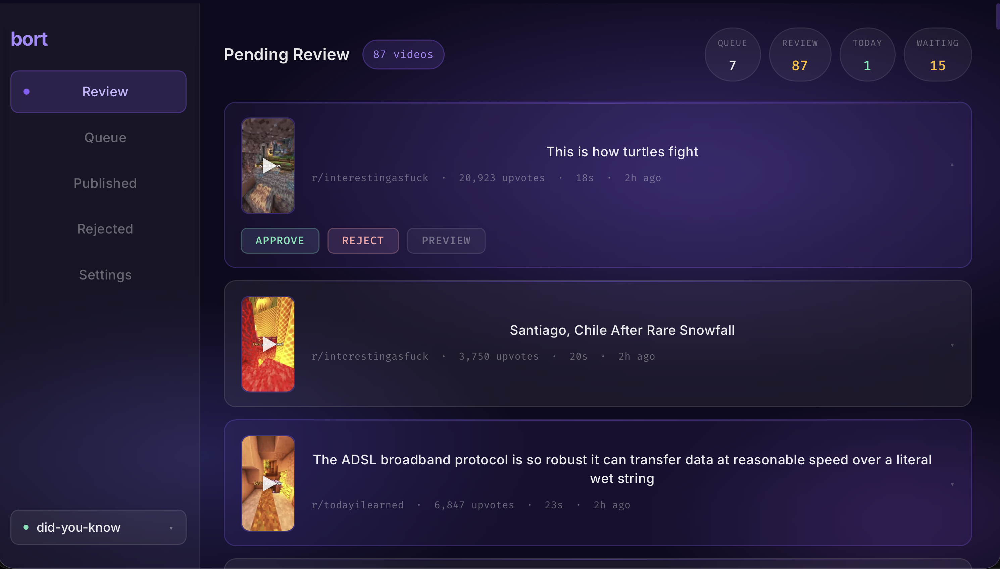

# 🎬 Bort: YouTube Shorts Automatic Editor & Uploader

<div align="center">
  
  
  
  
  <br>
  <strong>La solución definitiva para la automatización masiva de contenido en YouTube Shorts.</strong>
</div>

---

## 🚀 Vision General

**Bort** es un ecosistema automatizado diseñado para creadores de contenido que buscan escalar su presencia en YouTube. El sistema se encarga del ciclo completo de vida de un video: desde la **edición algorítmica** y la **generación de contenido** hasta la **subida automatizada**, todo gestionado desde un potente panel de control centralizado.

> [!IMPORTANT]
> Este proyecto está diseñado para ser ejecutado en entornos Dockerizados, garantizando que todos los servicios (backend, frontend y workers) funcionen en armonía sin conflictos de dependencias.

---

## 🖥️ Preview del Dashboard

A continuación se muestra la interfaz principal desde donde se gestionan los videos y se monitorizan las tareas de subida:

<div align="center">
  
  <p><em>Vista centralizada del estado de los videos y colas de procesamiento.</em></p>
</div>

---

## ✨ Características Principales

- **🤖 Edición Automática:** Generación de videos en formato 9:16 optimizados para la retención en Shorts.
- **📊 Dashboard de Control:** Interfaz moderna desarrollada en TypeScript para gestionar el flujo de trabajo.
- **☁️ Uploader Integrado:** Sistema de subida automática a YouTube mediante su API oficial o automatización de navegación.
- **🐳 Arquitectura Robusta:** Implementación mediante microservicios con Docker y Docker Compose.
- **🛡️ Nginx Proxy:** Configuración lista para producción con balanceo y seguridad.
- **🔧 Altamente Configurable:** Control total mediante variables de entorno y archivos de configuración.

---

## 🏗️ Estructura del Proyecto

El repositorio está organizado de forma modular:

* **`dashboard/`**: Aplicación frontend construida con TypeScript y herramientas modernas de UI.
* **`services/`**: El núcleo del proyecto. Contiene la lógica de edición de video, procesamiento de IA y comunicación con APIs externas.
* **`nginx/`**: Configuraciones de servidor para servir el dashboard y actuar como proxy inverso para el backend.
* **`scripts/`**: Utilidades de mantenimiento, migración y tareas programadas.
* **`tests/`**: Suite de pruebas para asegurar la estabilidad del generador de videos.

---

## 🛠️ Requisitos Previos

Antes de comenzar, asegúrate de tener instalado:
- **Docker** (v20.10+)
- **Docker Compose** (v2.0+)
- **Credenciales de YouTube API** (archivo `client_secrets.json`)

---

## ⚙️ Configuración e Instalación

### 1. Clonar el repositorio
```bash
git clone [https://github.com/jorgeMartinez293/bort.git](https://github.com/jorgeMartinez293/bort.git)
cd bort
